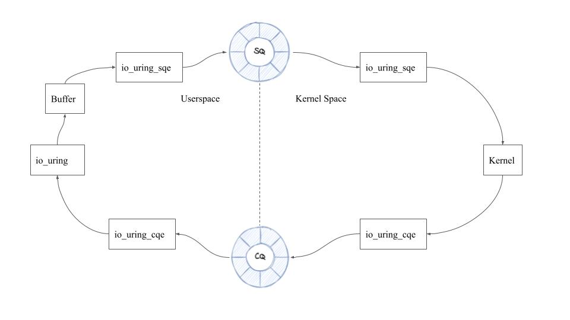
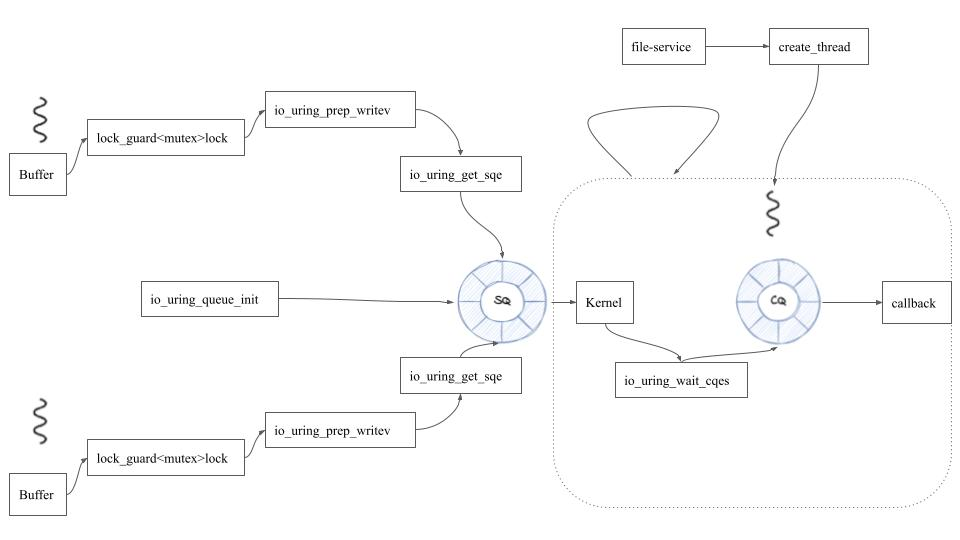
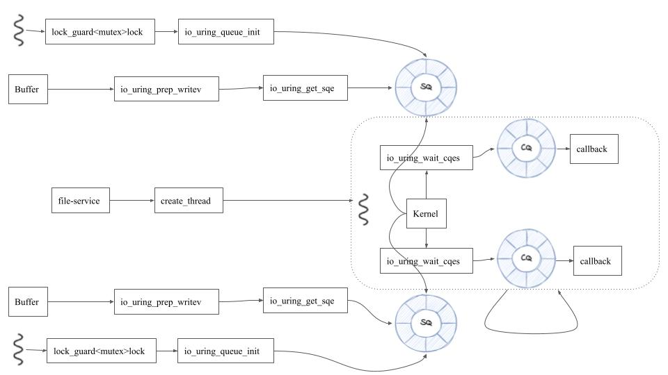
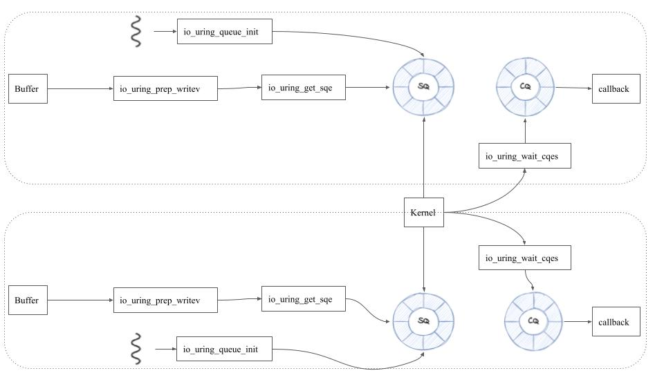

**Programming Language**: C++, C

**Techniques**: multiple threads programming, kernel programming, unit test.

**Project Background**

The increasing use of the cloud-based relational database brings three usage requirements: first, the I/O bottleneck between the database that requests the I/O and the storage that performs I/O is desirable to be solved. Secondly, the synchronous operations that may cause the context switch is another issue that needs to be addressed. Thirdly, traditional commit protocols such as 2PC are not suitable for building the fault tolerance system. Therefore, a new database system - AWS Aurora is developed to meet the above requirements. But according to the benchmark, the CPU acts as a barrier to high-efficiency I/O performance. The new kernel interface called Io uring supports asynchronous I/O by use of a ring buffer. This project is to utilize the io_uring to the Aurora Storage and benchmarking the performance.

**Task**

The project has following milestone:

|                                                  |                        |
| ------------------------------------------------ | ---------------------- |
| **Task descrption**                              | **Deliverable Result** |
| Understand and examine AWS's current I/O process | presentation           |
| Understand the AIO and io_uring usage            | presentation           |
| To confirm that CPU is the bottleneck            | Bechmark               |
| Embed io_uirng non-poll mode into the kernel     | Unit Test & benchmark  |
| Benchmark result to check the improvements       | Bechmark               |
| Embed io_urung poll mode into the kernel         | Unit Test & benchmark  |
| Clean the code                                   | CR                     |
| Present the results                              | NA                     |

**The First Design:**

The workflow for the first design, which employs the one thread, several threads approach, is shown below. One thread continues to query the kernel for new completed requests. The downside of the first design is that lock has to be used to protect each submission queue, which downgrades the performance.

**The Second Design:**

By allowing each thread to have its own submission queue, we optimize our architecture to get around the drawback of the first one. The second gets 1000X IOPS improvements.

\
**The Third Design**:

By allowing each thread to have its own submission and completion queue, we were able to further improve our design. An additional 100X improvement is made to the end output.

