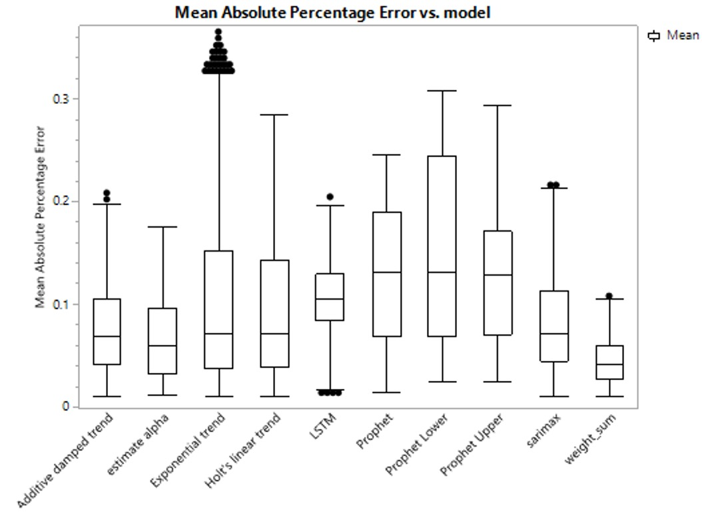

Forecasting systems, especially in dynamic industries like hospitality, often encounter prediction inaccuracies. Recognizing the potential to not only anticipate but also rectify these errors can significantly enhance the system's robustness and operational efficiency. This project is a testament to this approach, applying stacked learning to forecast the forecasting errors in hotel occupancy predictions. Our innovative methodology not only sharpened the forecasting accuracy but also played a pivotal role in boosting revenue.

#### Project Structure and Methodology

The project unfolds in two critical steps, each leveraging distinct data sets and analytical methods to refine the forecasting precision progressively.

**Step 1: Initial Time-Series Forecasting**

* **Data Utilized:** The model harnesses the past 91 days of actual occupancy data to establish a baseline forecast.
* **Methods Employed:** We employed time-tested techniques like Simple Smoothing, Double Exponential Smoothing, and ARIMA for initial predictions. These methods provide a foundational forecast for the subsequent refinement process.
* **Forecast Objective:** The primary goal in this phase is to predict hotel occupancy for the forthcoming 14 days.

**Step 2: Refinement Using Machine Learning (Stacking)**

* **Data Employed:** This phase capitalizes on the 91 days of forecast data generated from Step 1, offering a rich dataset for further refinement.
* **Analytical Methods:** We integrated advanced machine learning models, specifically Random Forest and XGBoost, to fine-tune the initial forecasts. These models are adept at handling complex patterns and non-linear relationships inherent in forecasting data.
* **Forecasting Goal:** Building upon the initial forecasts, this step aims to provide a more refined 14-day occupancy prediction.

#### Outcomes and Impact

The project's innovative approach to forecasting error prediction and stacked learning yielded substantial improvements:

* **Reduction in Mean Absolute Percentage Error (MAPE):** We successfully decreased the MAPE from 0.17 to a remarkable 0.04. This significant reduction in error rate underscores the effectiveness of our stacked learning approach.
* **Revenue Boost:** The enhanced accuracy directly translated into a revenue increase, contributing over $12 million to the business. This figure highlights the immense financial benefits of accurate forecasting in the hospitality sector.
* **System Robustness:** By forecasting and correcting potential errors, the system's reliability and robustness were notably improved, ensuring more consistent and dependable occupancy predictions.

  

#### Conclusion

This project illustrates the transformative power of advanced analytics in forecasting. By integrating time-series analysis with machine learning, we not only elevated the accuracy of hotel occupancy predictions but also demonstrated the substantial financial and operational benefits of such an approach. The success of this project sets a benchmark for forecasting in dynamic environments, paving the way for more intelligent, data-driven decision-making in the hospitality industry and beyond.