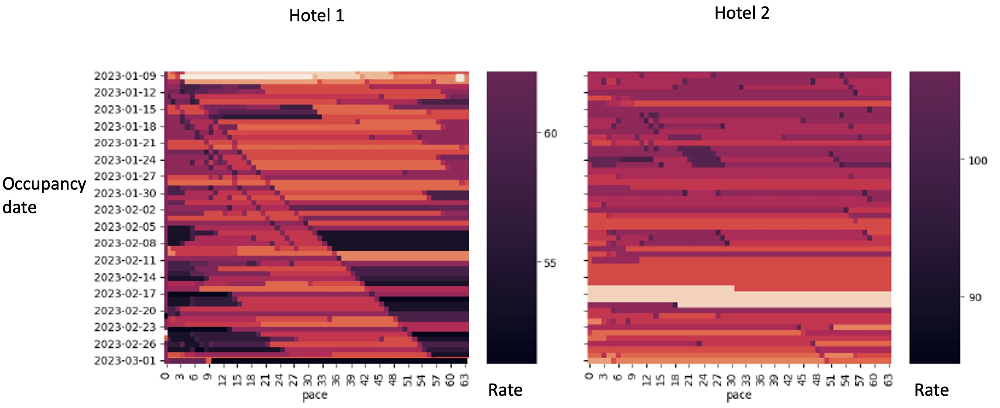
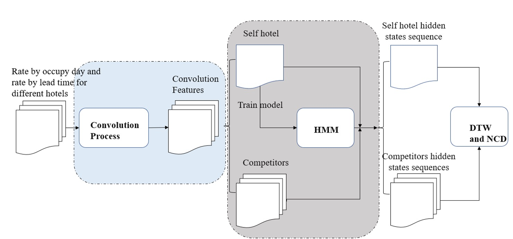
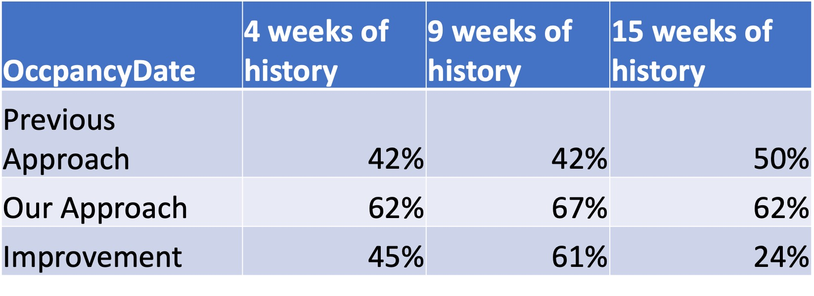

In the fiercely competitive hospitality industry, understanding your competitors is crucial for strategic positioning and pricing decisions. This project introduces a cutting-edge system designed to analyze and identify hotel competitors based on sophisticated algorithms and critical data features.

#### Core Objectives and Methodology

The system's primary objective is to accurately determine potential competitors of a given hotel by analyzing similarity scores. These scores are computed using a blend of algorithms and key features:

* **Algorithms Utilized:** Hidden Markov Model (HMM) and Dynamic Time Warping (DTW). These algorithms are adept at handling time series data and uncovering underlying patterns in pricing and geographical trends.
* **Features Considered:** The system focuses on two pivotal features – rate value and geographical location. These are instrumental in determining the competitive landscape of a hotel.
* **Similarity Score:** The essence of this system lies in its ability to quantify similarity, with scores ranging from 0 to 1. A score of 1 denotes identical behavior, while 0 indicates no correlation.

#### Purpose and Advantage

* **Hidden Markov Model (HMM):** Efficiently models time series data, capturing hidden state sequences more effectively than direct similarity measurements, especially the data variance is different.
* **Dynamic Time Warping (DTW):** Measures similarity between time series sequences.
* **Combination Benefit:** The use of HMM and DTW together surpasses traditional Correlation Measures, especially when dealing with time series data exhibiting similar observable values or patterns.

#### Input Data Structure

* **RDL Table:** Includes hotel ID, arrival and shop dates, room type, and rate.
* **Location Table:** Contains hotel ID, latitude, and longitude.

#### Output Data Structure

* Outputs include self and competitor hotel IDs, final similarity score, and competitor identification.

#### Algorithm Workflow

1. **Data Cleaning and Processing:** Involves selecting valid days, identifying nearby hotels, filling missing rate data, and standardizing room type rates.
2. **Daily Component Computation:** Calculates daily median rates and predicts hidden state sequences using HMM.
3. **Pace Component Computation:** Standardizes rates by DTA (days to arrival), convolves rate sequences, and calculates median DTW scores.
4. **Similarity Score Transformation:** Converts DTW distances into similarity scores, combining them to provide a relative measure of similarity.

#### Key Processes

* **Competitor Selection:** Chooses top 50 nearest competitors within 26 km and processes rate data for up to 64 days.
* **Standardization and Convolution:** Utilizes specific algorithms for data standardization and convolution, crucial for accurate similarity score computation.
* **Total Weight Computation:** Normalizes similarity scores, allowing for impact categorization (e.g., low, medium, high).

#### Final Output

* The algorithm outputs a nuanced similarity score, offering a sophisticated, data-driven perspective on hotel competition, crucial for strategic decision-making in the hospitality sector.

